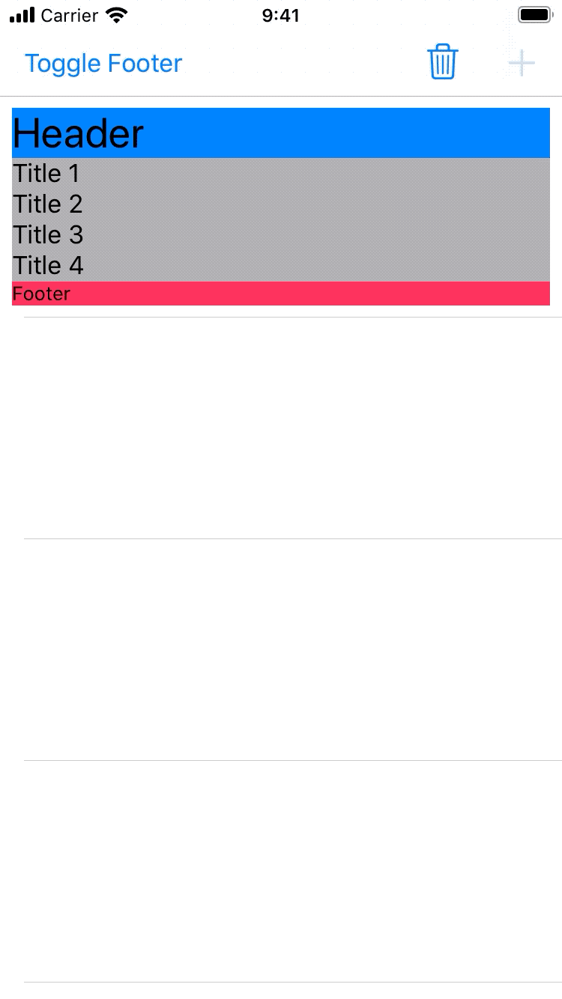

# `AnimatedUITableViewCell`

`AnimatedUITableViewCell` is a a `UITableViewCell` subclass that contains a header, footer, and a `UIStackView` for adding content.

The cell provides methods to automatically animate the insert and delete of views in to the `UIStackView`, along with hiding and showing the footer.

This project is not meant to be used as a dependency or even directly copy/pasted, but it is an example of how to do this.

I have seen many examples of ways to do this, but they often do not work with `UIStackView` or only work with a specific layout.

This project has been tested back to iOS 11, but does have some [known issues](https://github.com/JosephDuffy/AnimatedUITableViewCell/issues), namely around performing mutliple _different_ animations at the same time.
